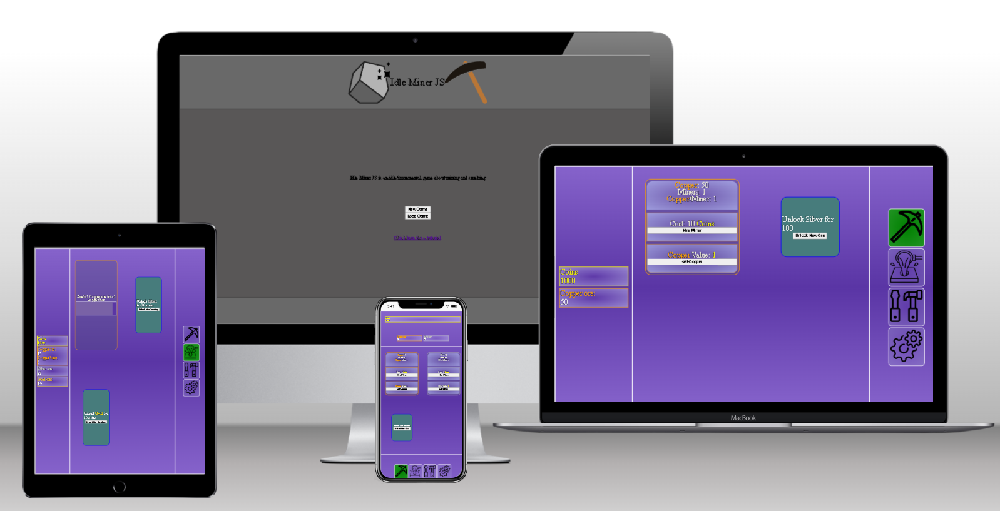

# Idle Miner JS

Idle Miner JS is an idle/incremental game made with html and javascript.
At the moment only ores and smelting are implemented.
Mine and sell ores for coins, use coins to upgrade mining speed, make more coins to buy further options like

* More valuable ores
* Smelting ores into bars

 https://derek1980d.github.io/Idle-Mining-JS/index.html

## Features 

__Home page__

 The Home page wiill have the option to start a new game or load progress from a previous session. There will also be a link to a tutorial page
 

__The Game__ 

The main game page will have
  * Stats panel, to show info on coins, ores, bars etc.
  * Menu for switcing between game areas or accessing the option.
  * Play area, will display the area selected from the game menu, ores or smelting so far

[//]: # (some screenshots here?)

## Testing

 Using https://jshint.com/ I got warnings for using brackets instead of . notation. I decided to keep brackets for creating new properties and methods for easier to read code, brackets is a new property or method, .notation is for accessing a property or method in this case.

 ### Validator Testing 

- HTML

  - [W3C validator](https://validator.w3.org)

https://validator.w3.org/nu/?doc=https%3A%2F%2Fderek1980d.github.io%2FIdle-Mining-JS%2Fgame.html
No errors

- CSS

  -  [(Jigsaw) validator](https://jigsaw.w3.org/css-validator)

https://jigsaw.w3.org/css-validator/validator?uri=https%3A%2F%2Fderek1980d.github.io%2FIdle-Mining-JS%2Fgame.html&profile=css3svg&usermedium=all&warning=1&vextwarning=&lang=en 
No errors

- I have tested all the buttons an menu links in the game to make sure the function correctly with no problems.

## Deployment

- The site was deployed to GitHub pages. The steps to deploy are as follows: 
  - In the GitHub repository, navigate to the Settings tab 
  - From the source section drop-down menu, select the Master Branch
  - Once the master branch has been selected, the page will be automatically refreshed with a detailed ribbon display to indicate the successful deployment. 

The live link can be found here - 
 https://derek1980d.github.io/Idle-Mining-JS/index.html

## Credits 

Lots of help here https://www.w3schools.com/
https://www.w3schools.com/js/js_modules.asp To find out how to import from other .js files for example.

  ### images

  - ore chunk Created by Deivid Sáenz https://thenounproject.com/deivid.saenz/
  - pickaxe Created by Mr. Minuvi https://thenounproject.com/minuvi/
  - ingot created by Tolicon https://thenounproject.com/tolicon/
  - upgrade icon crated by sbts https://thenounproject.com/sbts2018/
  - pickaxe icon created by Omeneko https://thenounproject.com/omeneko/
  - smelting icon created by Noura Mbarki https://thenounproject.com/mbarki_noura/
  - hammer and screwdriver icon created by B Farias https://thenounproject.com/bfarias/
  - settings icon created by Mada Creative https://thenounproject.com/madadesign/